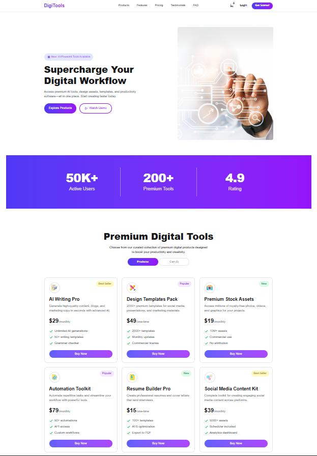

# DigiTools

## Description

** Digital Tools Marketplace is a modern and responsive web application where users can explore and purchase various digital tools such as templates, resume builders, design assets, and more. The platform allows users to browse products, view detailed features, and add items to a cart for checkout. It provides a smooth and interactive shopping experience with real-time cart updates and notifications.**
---

## Technologies Used

* **React.js** – For building the user interface
* **Tailwind CSS** – For fast and responsive styling
* **DaisyUI** – For pre-built UI components
* **JavaScript (ES6+)** – Core programming language
* **React-Toastify** – For alert notifications
* **JSON** – For managing product data
---  

## Key Features

### 1. Interactive Cart System

* Add products to the cart instantly
* View total items in the navbar
* Remove individual items or clear the cart بالكامل using “Proceed to Checkout”

### 2. Product & Cart Toggle System

* Easily switch between product listing and cart view
* Default product view with dynamic updates
* Empty cart message when no items are selected

### 3. Real-Time Notifications

* Toast alerts for add, remove, and checkout actions
* Smooth user feedback using React-Toastify

---

 *Bonus Features:*

* “Buy Now” button updates dynamically after clicking
* Fully responsive design for mobile, tablet, and desktop
* Clean UI based on Figma design inspiration

 *This project demonstrates modern frontend development practices using React and component-based architecture.*
 ---

 ## Project Preview 
 
